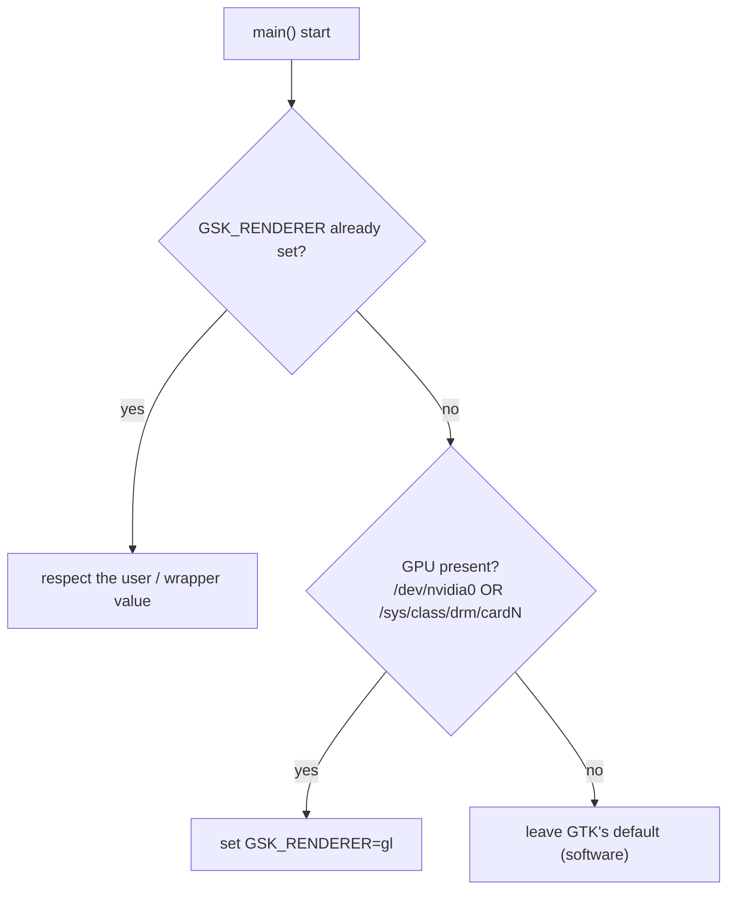
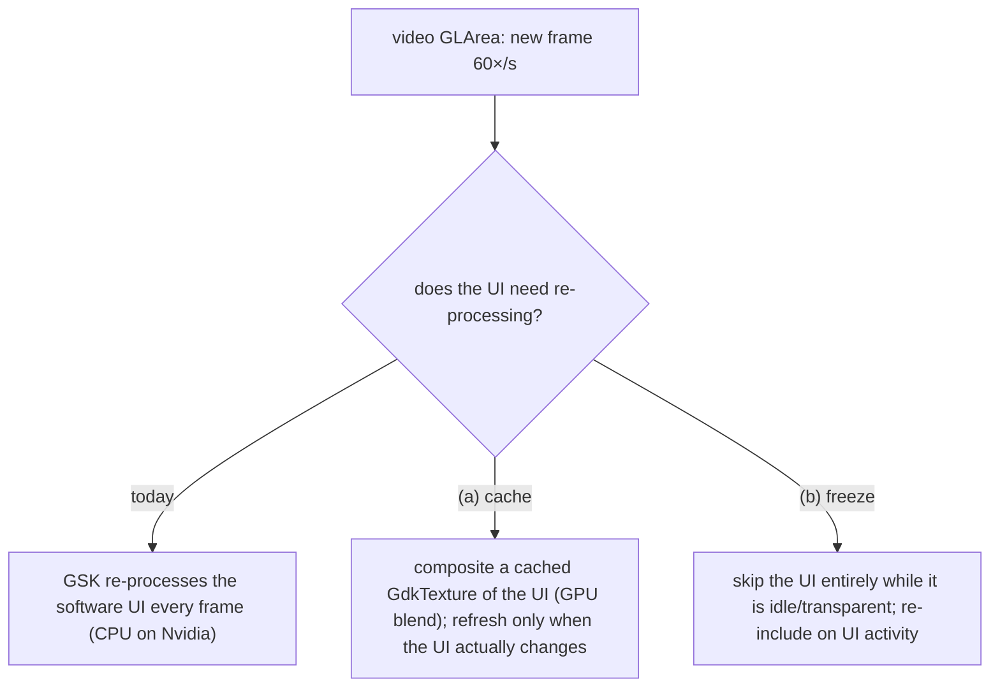

# Architecture Decision Records

Records of the architecture decisions behind the playback-CPU fix and the
multi-distro Debian packaging. Narrative and measurements live in
[`DEVLOG.md`](./DEVLOG.md); this file states the decisions, why they hold, and
what they cost.

Format: lightweight [MADR](https://adr.github.io/madr/). Status is per-record.

---

## ADR-0001 — Select the GSK renderer from GPU presence, in the binary

**Status:** Accepted, in validation (broad-GPU behaviour under test via the
`v1.1.2-cpu-deb-test2` release).

### Context

- GTK 4.14+ defaults to the **Vulkan** GSK renderer where Vulkan is available.
- The shell draws video into an OpenGL `GtkGLArea`. Compositing that GL texture
  through the Vulkan renderer forces a per-frame **GL → Vulkan bridge** that
  dominates playback CPU even with hardware decode — measured ~24% vs ~7.8% for
  the GL renderer on AMD/Mesa (see DEVLOG §1).
- The GL renderer composites a GL `GLArea` **natively**, with no bridge, so for
  this specific workload it cannot be slower than Vulkan on any driver.
- Upstream already worked around this, but only for the proprietary Nvidia
  driver (`/dev/nvidia0`) and only in the launcher script `data/stremio.sh`
  (commit `638b5af`). Upstream PR #69 (VA-API Wayland decode) is unrelated to the
  compositor renderer.

### Decision

Choose the renderer in the **binary**, before GTK initialises:

Implemented as `gpu::preferred_gsk_renderer()` (`src/gpu.rs`, std-only) returning
`Some("gl")` when a GPU is present, wired into `main.rs`.

Three sub-decisions:

1. **In the binary, not the shell wrapper.** `main.rs` runs in *every* package
   (deb, Flatpak, run-from-source); the wrapper is Flatpak/deb-only and Nvidia-only.
   The binary is the single place that fixes all of them, and it composes with
   the wrapper (which sets `opengl` for Nvidia first — respected by the `is_none`
   guard; `opengl` and `gl` are the same renderer).

2. **Gate on GPU presence, not GPU vendor.** The bridge cost is structural to
   "GL GLArea through the Vulkan compositor" and shared across Mesa drivers
   (AMD, Intel, nouveau); the GL renderer has no downside for this workload. A
   vendor allow-list would exclude drivers that pay the same cost on the excuse
   of "unmeasured". Only true software rendering (no GPU) keeps GTK's default.

3. **Value `gl`, and never override the user.** `gl` == `opengl` on GTK
   4.14–4.22 and is the canonical `GSK_RENDERER=help` name. An explicit
   `GSK_RENDERER` always wins.

### Consequences

**Positive**

- The CPU fix applies across GPU vendors and across all package formats.
- It also fixes run-from-source on Nvidia, which the wrapper-only approach misses.
- The renderer logic is isolated, documented, and testable in std-only code.

**Negative / risks**

- It **overrides GTK's chosen default (Vulkan)** for all GPU users — deliberate,
  but broader than upstream's Nvidia-only scope.
- The broad default is **verified only on AMD**; Intel and nouveau are reasoned
  from the shared Mesa mechanism, not measured. The residual risk is a
  driver-specific GL *visual* quirk, not CPU. Mitigated by (a) the `GSK_RENDERER`
  escape hatch and (b) the `v1.1.2-cpu-deb-test2` release for cross-GPU testing.
- If upstreamed, this changes the **official Flatpak** for all Linux users, so
  the blast radius warrants the cross-GPU testing before promotion.

### Alternatives considered

- **Unconditional `gl` (v1).** Simplest, but forces GL with no GPU and reads as a
  blunt override. GPU-present is barely more code and documents intent.
- **Nvidia-only, in the wrapper (upstream).** Under-inclusive: never fires on
  AMD (no `/dev/nvidia0`), so it would not have fixed the machine that motivated
  this work.
- **Vendor allow-list (Nvidia + AMD, v2).** Excludes Intel/nouveau, which share
  the mechanism; rejected as false conservatism.
- **Architectural fix — dmabuf paintable + `GtkGraphicsOffload`.** Feed mpv output
  as a dmabuf paintable and let GTK offload it to a Wayland subsurface, bypassing
  GSK compositing (and this whole renderer question) entirely. The correct
  long-term direction, but a rework of `src/app/video/imp.rs` and out of scope for
  a CPU fix. Recorded as future work.

---

## ADR-0002 — One `.deb` per Ubuntu release, built and verified in release containers

**Status:** Accepted.

### Context

- The crate pins GTK/libadwaita/WebKitGTK API levels via Cargo feature sets; a
  single build cannot target Ubuntu releases that ship different library
  versions.
- cargo-deb's `$auto` derives `Depends` names and floors from what the binary
  links — but only correctly when the matching `-dev` packages are present.
  Otherwise `dpkg-shlibdeps` invents a name from the SONAME (`libgtk-4` instead
  of the real `libgtk-4-1`) and the deb builds cleanly yet installs nowhere.
- A hand-pinned `Depends` (`libgtk-4-1 (>= 4.22) …`) is wrong for every release
  but one and made the 24.04 deb uninstallable.

### Decision

- **Targets are data:** `packaging/releases.json` maps each Ubuntu release to a
  feature set; CI and the local harness both read it, so they cannot drift.
- **Build each deb in a container of its target release**, so `$auto` resolves
  dependencies against that release's actual libraries. Encode the release in the
  Debian revision (`1~ubuntu24.04`) — `~` sorts before any suffix, so 24.04 →
  26.04 is an upgrade, not a phantom downgrade.
- **Verify by installing into a *fresh* container** of the same release (no
  `-dev` packages) before shipping — the only check that catches invented
  dependency names. This is `packaging/verify-deb.sh`, run identically by CI and
  `packaging/test-deb.sh`.
- `Depends = "$auto, nodejs"` (nodejs isn't linked, so `$auto` is blind to it);
  `Recommends = desktop-file-utils, hicolor-icon-theme` (dpkg file triggers for
  URL-scheme + icon registration; the app runs without them).

### Consequences

- Adding an Ubuntu release is one entry in `releases.json`.
- Correct, minimal `Depends` per release; regressions are caught before publish.
- **Ubuntu 22.04 cannot be targeted** at any feature set: `webkit6`'s generated
  bindings reference `gtk::Accessible` (GTK v4_10+), and 22.04 ships GTK 4.6. The
  failure is inside the dependency, so no feature selection avoids it.
- Slightly heavier CI (a container build + a fresh-container verify per release).

---

## ADR-0003 — Decouple the UI overlay's compositing from the video frame clock

**Status:** Proposed, mechanism **(a) validated by measurement** (DEVLOG §17);
implemented behind `STREMIO_CACHED_OVERLAY` for a final real-playback A/B.
Reworked after the subsurface/offload approach was rejected (see below).
Motivated by DEVLOG §10–§11, §16–§17.

### Context

ADR-0001 (`gl` renderer) fixes AMD/Mesa but **does not** fix Nvidia: a full CPU
core stays pinned during playback. Root cause (DEVLOG §11):

- The window is a `GtkOverlay` — video `GtkGLArea` underlay, **transparent**
  WebKitGTK UI overlay on top.
- On the proprietary Nvidia driver the UI snapshots to a software `GskCairoNode`.
  New this round (DEVLOG §16, via `webkit://gpu`): WebKit's
  **hardware-acceleration `Policy` is `never` by default** in this build
  (`webkit6` only exposes `Always`/`Never` — no `OnDemand`), so WebKit does no
  accelerated compositing at all. On Mesa the UI still ends up a GPU texture (the
  Skia CPU raster is uploaded cheaply); on Nvidia the whole thing stays on the CPU.
- Because that software surface **overlaps** the video, and the video changes
  every frame, GSK re-processes the UI on the CPU **60×/s** even though the UI
  itself is unchanged. That per-frame re-processing of an *unchanging* overlay is
  the waste — and it is a waste on every driver, just cheap enough to ignore on
  Mesa.

**Why the obvious fix is rejected.** Putting the video on its own Wayland
subsurface (`GtkGraphicsOffload` + a dmabuf `GdkPaintable`) *would* bypass GSK —
but [GTK declines to offload at fractional
scales](https://blog.gtk.org/2024/04/17/graphics-offload-revisited/), and
fractional scaling is common enough that shipping a fix that silently does nothing
for those users is unacceptable. **Any subsurface/offload-based approach is out.**

### Decision (proposed)

Attack the actual waste — re-compositing an **unchanging** UI at video frame rate
— within a single GSK surface (no subsurface, so scale-independent and
all-driver). Two mechanisms are viable; pick per the §16 experiment:

- **(a) Cache the UI as a texture (preferred — implemented, measured).**
  `src/app/cached_overlay/` (`StremioCachedOverlay`) keeps the WebView parented
  (so it renders and receives input) but draws a cached `GtkWidgetPaintable::current_image()`
  of it, refreshed only on the child's `invalidate-contents` (and on a size
  change), never per video frame. Per-frame cost becomes a **GPU texture blend at
  any scale**; DEVLOG §17 measures it at the no-overlay floor. Behind
  `STREMIO_CACHED_OVERLAY` pending the real-playback A/B. Keeps the UI always
  visible (no UX change).
- **(b) Freeze/skip the idle overlay (lighter).** Set the WebView
  `visible=false` (or otherwise exclude it from the snapshot) while the player UI
  is idle and transparent, and restore it on pointer/key activity. Trivial to
  implement; risk is any web-drawn content that must stay visible during playback
  (needs the §16 subtitle check).
- **Complement, both cases:** set
  `settings.set_hardware_acceleration_policy(Always)` (default is `Never`). It is
  necessary (not sufficient) and reduces the software-render cost on the
  UI-change path for everyone.

### Per-platform outcome

Scale-independent by construction. Expected: **Nvidia** drops from ~1 pinned core
to roughly the video-composite cost (steady playback re-processes the UI ~1/s, not
60/s); **Mesa** gets slightly cheaper too (fewer per-frame uploads); **no platform
regresses** — worst case the UI re-composites as often as today.

### Open question — now answered by measurement (DEVLOG §17)

Was the per-frame cost the UI being **re-snapshotted** every frame, or GSK
**re-compositing an unchanged** cairo node every frame? The `overlay_bench`
micro-benchmark settles it: a static software (`GskCairoNode`) overlay over a
churning GLArea invalidates its contents **0 times** yet still costs ~90% of a
core at 1440p. So the waste is **GSK re-processing an unchanging node**, and
**mechanism (a) — caching the UI as a texture — is the correct fix.** Measured,
same box, `GSK_RENDERER=gl`:

| size | `cairo` (today) | `cached` (fix) | `texture` (ideal) |
| ---- | --------------- | -------------- | ----------------- |
| 1280×720  | 62.6% / 60 fps | 17.5% / 60 fps | 18.6% / 60 fps |
| 2560×1440 | 94.6% / 21 fps | 19.6% / 60 fps | 20.2% / 60 fps |

`cached ≈ texture ≈ no-overlay`: the `WidgetPaintable::current_image()`
implementation already composites as a GPU texture node, so no `render_texture`
rewrite is needed. The win grows with resolution (the user runs 4K/170%).

**Residual check (hardware, low risk):** the benchmark uses a static child, so it
cannot prove the cache *refreshes* correctly when the real WebView updates
(seekbar tick, buffering spinner, subtitles). One real-playback A/B
(`STREMIO_CACHED_OVERLAY=1`) confirms those still update through the cache. A
`BENCH_CHILD_DIRTY` stress (child repaints every frame) already shows the cache
does not collapse to the software cost even under continuous invalidation
(21.9% vs 93.6% at 1440p).

### Consequences

**Positive** — works at every scale and on every driver (the constraint the
subsurface approach failed); no dependency on GTK offload or a WebKit-on-Nvidia
upstream fix; keeps the `gl` default and composes with ADR-0004.

**Negative / risks**
- (a) is a real snapshot/texture-cache layer with correct invalidation (contents
  change, resize/DPI — both handled and unit-tested). Residual risk is refresh
  correctness for web-drawn playback elements (subtitles, spinner), which the
  hardware A/B confirms.
- Still leaves WebKit rendering the UI in software on Nvidia — only its *frequency*
  is fixed. Acceptable: the UI changes rarely; the video does not.

### Alternatives considered (rejected)

- **`GtkGraphicsOffload` / dmabuf video subsurface.** The clean bypass, but GTK
  declines it at fractional scale → breaks a large share of users. **Rejected**
  (this is the reversal from the first draft of this ADR).
- **`hardware-acceleration-policy=Always` alone.** Necessary but insufficient on
  Nvidia — the transparent overlay still snapshots to `GskCairoNode` in testing.
  Kept only as a complement above.
- **Force an integer scale / `GSK_RENDERER=cairo`.** User-hostile / makes
  everything software. Rejected.
- **Wait for upstream WebKit Skia-GPU-on-Nvidia.** Out of the shell's hands and
  no ETA; track it, but do not depend on it for the fix.

---

## ADR-0004 — Scope zero-copy `hwdec` to interops we've verified

**Status:** Proposed. Motivated by DEVLOG §12; needs a playback session to confirm.

### Context

`a7597b7` sets `hwdec=auto-safe` at init and `c1123bc` remaps the web UI's
`hwdec=auto-copy` request to `auto-safe` (`video/mod.rs:131`). `auto-safe` is the
**zero-copy** GPU interop; `auto-copy` copies frames back through system memory.

That change was **verified on VAAPI/Mesa only** ("Using EGL dmabuf interop via
`GL_OES_EGL_image` … Initialized VAAPI"). On the Nvidia box the deb (which forces
`auto-safe`) shows **playback artifacts**; the upstream stable Flatpak — which
sets no `hwdec`, so the web UI's `auto-copy` stands — does **not**, on the same
GTK/mpv versions. So forcing zero-copy on Nvidia's nvdec/CUDA-GL interop is a
**regression**. It is not local to this branch: the same commits ride in upstream
**PR #108**, so merging that PR as-is ships the artifacts to the official Flatpak.

### Decision (proposed)

Do **not** force the zero-copy interop where it is unverified. Prefer the web UI's
`auto-copy` unless the shell has reason to believe zero-copy is sound:

- Apply the `auto-copy → auto-safe` remap (and the init default) **only for the
  VAAPI/Mesa interop** (the one measured), leaving the proprietary Nvidia path on
  the copy-back `auto-copy` the web UI already asks for; **or**
- gate zero-copy on a successful interop probe at render-context creation.

The exact predicate is an implementation detail; the decision is that
`auto-safe`'s scope must match what we've validated, per platform.

### Consequences

- **Positive:** clears the Nvidia artifacts; keeps the measured AMD/Intel zero-copy
  win (that is what `a7597b7`/#107 were about); makes the default honest about
  where it's been proven.
- **Negative:** copy-back on Nvidia costs some CPU vs a (currently broken) zero-copy
  path — an acceptable trade until the Nvidia interop is verified. A per-interop
  predicate is slightly more code than a blanket default.
- **Validation gate:** confirm on the Nvidia box that `auto-copy` clears the
  artifacts before flipping the default (or before PR #108 merges).

### Alternatives considered

- **Keep the blanket `auto-safe`.** Ships known artifacts to Nvidia users. Rejected.
- **Drop hwdec defaults entirely (upstream `main` behaviour).** Loses the verified
  AMD/Intel zero-copy win and reintroduces #107's software-decode cost. Rejected.

---

## Related decisions recorded elsewhere

These were decided during the same work but live in their natural homes:

- **GPU-video-processing / `d3d11vpp` toggle** is Windows-only; the Linux shell
  logs it as unsupported. No change.
- **VLC-in-Flatpak detection** cannot be fixed in this shell — player detection
  is in the closed-source `server.js`. Filed upstream. See DEVLOG §8.
- **`server.js` performance** is I/O-bound with no hotspot; no drop-in backend
  changes playback CPU. See DEVLOG §8.
