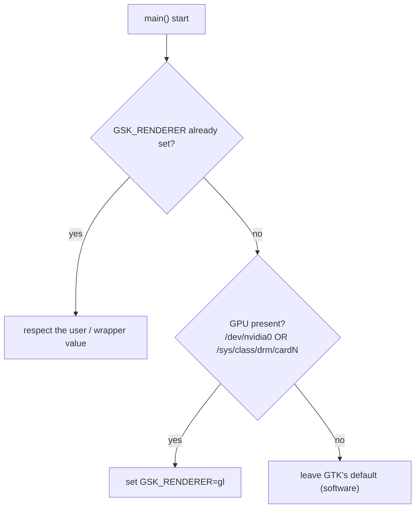
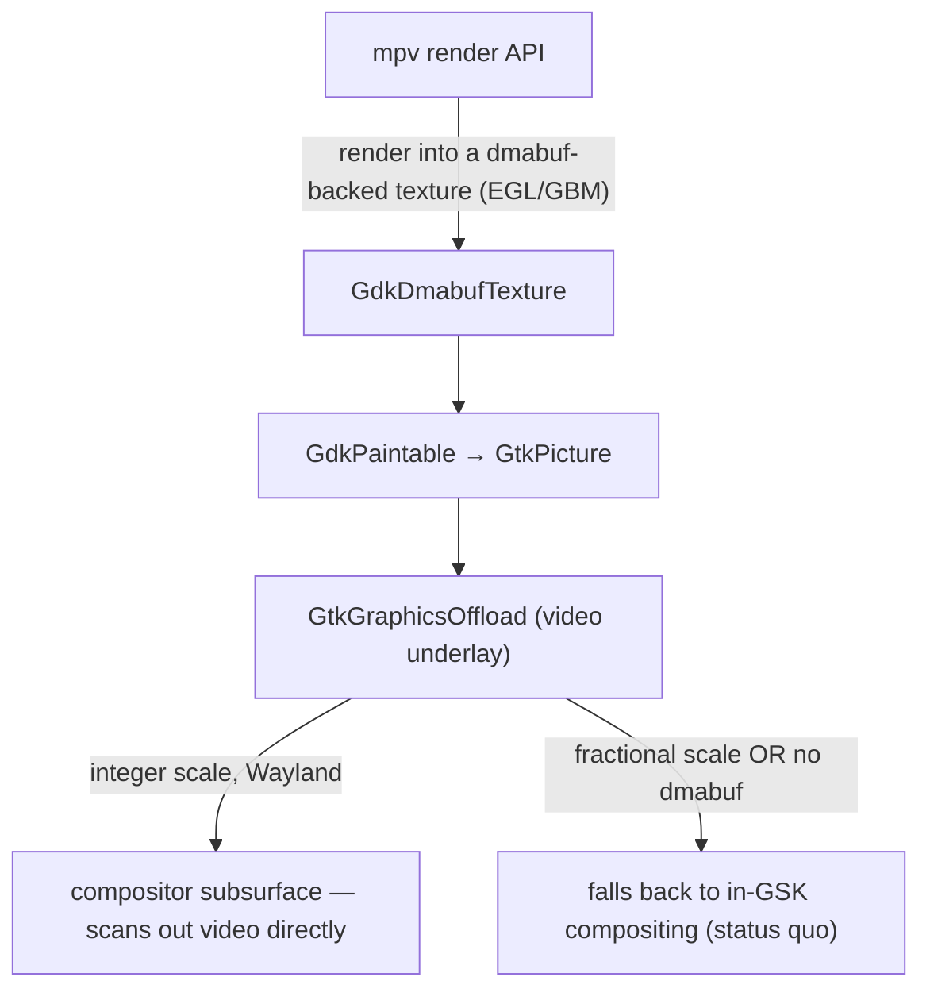

# Architecture Decision Records

Records of the architecture decisions behind the playback-CPU fix and the
multi-distro Debian packaging. Narrative and measurements live in
[`DEVLOG.md`](./DEVLOG.md); this file states the decisions, why they hold, and
what they cost.

Format: lightweight [MADR](https://adr.github.io/madr/). Status is per-record.

---

## ADR-0001 — Select the GSK renderer from GPU presence, in the binary

**Status:** Accepted, in validation (broad-GPU behaviour under test via the
`v1.1.2-cpu-deb-test2` release).

### Context

- GTK 4.14+ defaults to the **Vulkan** GSK renderer where Vulkan is available.
- The shell draws video into an OpenGL `GtkGLArea`. Compositing that GL texture
  through the Vulkan renderer forces a per-frame **GL → Vulkan bridge** that
  dominates playback CPU even with hardware decode — measured ~24% vs ~7.8% for
  the GL renderer on AMD/Mesa (see DEVLOG §1).
- The GL renderer composites a GL `GLArea` **natively**, with no bridge, so for
  this specific workload it cannot be slower than Vulkan on any driver.
- Upstream already worked around this, but only for the proprietary Nvidia
  driver (`/dev/nvidia0`) and only in the launcher script `data/stremio.sh`
  (commit `638b5af`). Upstream PR #69 (VA-API Wayland decode) is unrelated to the
  compositor renderer.

### Decision

Choose the renderer in the **binary**, before GTK initialises:

Implemented as `gpu::preferred_gsk_renderer()` (`src/gpu.rs`, std-only) returning
`Some("gl")` when a GPU is present, wired into `main.rs`.

Three sub-decisions:

1. **In the binary, not the shell wrapper.** `main.rs` runs in *every* package
   (deb, Flatpak, run-from-source); the wrapper is Flatpak/deb-only and Nvidia-only.
   The binary is the single place that fixes all of them, and it composes with
   the wrapper (which sets `opengl` for Nvidia first — respected by the `is_none`
   guard; `opengl` and `gl` are the same renderer).

2. **Gate on GPU presence, not GPU vendor.** The bridge cost is structural to
   "GL GLArea through the Vulkan compositor" and shared across Mesa drivers
   (AMD, Intel, nouveau); the GL renderer has no downside for this workload. A
   vendor allow-list would exclude drivers that pay the same cost on the excuse
   of "unmeasured". Only true software rendering (no GPU) keeps GTK's default.

3. **Value `gl`, and never override the user.** `gl` == `opengl` on GTK
   4.14–4.22 and is the canonical `GSK_RENDERER=help` name. An explicit
   `GSK_RENDERER` always wins.

### Consequences

**Positive**

- The CPU fix applies across GPU vendors and across all package formats.
- It also fixes run-from-source on Nvidia, which the wrapper-only approach misses.
- The renderer logic is isolated, documented, and testable in std-only code.

**Negative / risks**

- It **overrides GTK's chosen default (Vulkan)** for all GPU users — deliberate,
  but broader than upstream's Nvidia-only scope.
- The broad default is **verified only on AMD**; Intel and nouveau are reasoned
  from the shared Mesa mechanism, not measured. The residual risk is a
  driver-specific GL *visual* quirk, not CPU. Mitigated by (a) the `GSK_RENDERER`
  escape hatch and (b) the `v1.1.2-cpu-deb-test2` release for cross-GPU testing.
- If upstreamed, this changes the **official Flatpak** for all Linux users, so
  the blast radius warrants the cross-GPU testing before promotion.

### Alternatives considered

- **Unconditional `gl` (v1).** Simplest, but forces GL with no GPU and reads as a
  blunt override. GPU-present is barely more code and documents intent.
- **Nvidia-only, in the wrapper (upstream).** Under-inclusive: never fires on
  AMD (no `/dev/nvidia0`), so it would not have fixed the machine that motivated
  this work.
- **Vendor allow-list (Nvidia + AMD, v2).** Excludes Intel/nouveau, which share
  the mechanism; rejected as false conservatism.
- **Architectural fix — dmabuf paintable + `GtkGraphicsOffload`.** Feed mpv output
  as a dmabuf paintable and let GTK offload it to a Wayland subsurface, bypassing
  GSK compositing (and this whole renderer question) entirely. The correct
  long-term direction, but a rework of `src/app/video/imp.rs` and out of scope for
  a CPU fix. Recorded as future work.

---

## ADR-0002 — One `.deb` per Ubuntu release, built and verified in release containers

**Status:** Accepted.

### Context

- The crate pins GTK/libadwaita/WebKitGTK API levels via Cargo feature sets; a
  single build cannot target Ubuntu releases that ship different library
  versions.
- cargo-deb's `$auto` derives `Depends` names and floors from what the binary
  links — but only correctly when the matching `-dev` packages are present.
  Otherwise `dpkg-shlibdeps` invents a name from the SONAME (`libgtk-4` instead
  of the real `libgtk-4-1`) and the deb builds cleanly yet installs nowhere.
- A hand-pinned `Depends` (`libgtk-4-1 (>= 4.22) …`) is wrong for every release
  but one and made the 24.04 deb uninstallable.

### Decision

- **Targets are data:** `packaging/releases.json` maps each Ubuntu release to a
  feature set; CI and the local harness both read it, so they cannot drift.
- **Build each deb in a container of its target release**, so `$auto` resolves
  dependencies against that release's actual libraries. Encode the release in the
  Debian revision (`1~ubuntu24.04`) — `~` sorts before any suffix, so 24.04 →
  26.04 is an upgrade, not a phantom downgrade.
- **Verify by installing into a *fresh* container** of the same release (no
  `-dev` packages) before shipping — the only check that catches invented
  dependency names. This is `packaging/verify-deb.sh`, run identically by CI and
  `packaging/test-deb.sh`.
- `Depends = "$auto, nodejs"` (nodejs isn't linked, so `$auto` is blind to it);
  `Recommends = desktop-file-utils, hicolor-icon-theme` (dpkg file triggers for
  URL-scheme + icon registration; the app runs without them).

### Consequences

- Adding an Ubuntu release is one entry in `releases.json`.
- Correct, minimal `Depends` per release; regressions are caught before publish.
- **Ubuntu 22.04 cannot be targeted** at any feature set: `webkit6`'s generated
  bindings reference `gtk::Accessible` (GTK v4_10+), and 22.04 ships GTK 4.6. The
  failure is inside the dependency, so no feature selection avoids it.
- Slightly heavier CI (a container build + a fresh-container verify per release).

---

## ADR-0003 — Decouple video presentation from GSK compositing (dmabuf paintable + graphics offload)

**Status:** Proposed. Motivated by the Nvidia investigation in DEVLOG §10–§11;
not yet prototyped (needs a hardware playback session).

### Context

ADR-0001 (`gl` renderer) fixes AMD/Mesa but **does not** fix Nvidia: a full CPU
core stays pinned during playback and the picture shows compositing artifacts.
Root cause (DEVLOG §11, confirmed with `GDK_DEBUG=offload` + `perf`):

- The window is a `GtkOverlay` — video `GtkGLArea` underlay, **transparent**
  WebKitGTK UI overlay on top.
- On the proprietary Nvidia driver, **WebKitGTK's Skia GPU context does not come
  up; it falls back to the Skia CPU worker**, so the UI snapshots to a
  `GskCairoNode` (software surface). Verify on any box with `webkit://gpu`.
- Because that software surface **overlaps** the video and the video changes every
  frame, GSK re-uploads (`memmove`) and re-composites (`libnvidia-eglcore`) it on
  the CPU 60×/s. On Mesa, Skia GPU works → the UI is a texture node → GPU
  compositing → cheap. That single difference is the whole Nvidia-vs-AMD split.

Two structural facts constrain any shell-side fix:

1. `GtkGraphicsOffload` only offloads a widget whose content is a single **dmabuf
   texture**. The current `set_overlay` wraps the **WebView** in
   `GtkGraphicsOffload` — a no-op ("Only textures supported (found
   GskCairoNode)"). And a `GtkGLArea` renders into a GL FBO
   (`GskGLTextureNode`), which is *also* not a scanout dmabuf — moving the wrapper
   onto the GLArea only "lowers" the subsurface, it never truly offloads.
2. [GTK **declines to offload at fractional scales**](https://blog.gtk.org/2024/04/17/graphics-offload-revisited/).
   The Nvidia test box runs **170 %**, so offload cannot engage there regardless.

The WebKit software fallback itself is **upstream** and not shell-fixable (no env
var forces the Skia GPU path up on Nvidia; `WEBKIT_DISABLE_DMABUF_RENDERER=1` only
makes it more software). Upstream has fixed the *GSK-renderer* half (`638b5af`,
PR #108, issue #103) but has **not** touched the WebKit recomposite, the
ineffective offload wrapper, or the fractional-scale interaction.

### Decision (proposed)

Stop compositing the video **through** GSK. Present it on its own Wayland
subsurface so per-frame video updates bypass GSK entirely, and the software UI is
re-composited only when *it* changes:

Concretely:

1. **Rework `src/app/video/imp.rs` from `GtkGLArea` + FBO to a `GtkPicture` fed by
   a dmabuf `GdkPaintable`.** mpv renders into a dmabuf-backed texture (EGL image
   over a GBM buffer, or mpv's dmabuf output), handed to GTK as a
   `GdkDmabufTexture`. This is the "future work" ADR-0001 parked.
2. **Move `GtkGraphicsOffload` off the WebView and onto the video** (the WebView
   can never offload; the dmabuf video can).
3. Keep the `gl` GSK default (ADR-0001) for the non-offloaded / fractional-scale
   path — it is still the cheapest fallback.

### Per-platform outcome

| Platform | Scale | Result |
| -------- | ----- | ------ |
| AMD / Intel / nouveau (Mesa) | any | Already OK via `gl`; offload is a bonus at integer scale (video off the GPU-composite path entirely). |
| **Nvidia (proprietary)** | **integer (100/200 %)** | **Fixed** — video scanned out by the compositor; the software UI is re-composited only on change, not per frame. |
| **Nvidia (proprietary)** | **fractional (e.g. 170 %)** | **Not fixed by the shell** — offload declines, video stays in GSK, WebKit software recomposite remains. Bottlenecked upstream (WebKit Skia-GPU-on-Nvidia). Mitigation: document `webkit://gpu`, recommend an integer scale, and track upstream. |

So this is "a fix for all platforms **where offload can engage**", plus an honest
upstream dependency for fractional-scale Nvidia. It never regresses a platform:
when offload can't engage it falls back to today's behaviour.

### Consequences

**Positive** — removes the per-frame GSK recomposite on the whole offload-eligible
matrix (biggest win on Nvidia); the fix is driver-agnostic; composes with the `gl`
default and with ADR-0004.

**Negative / risks**
- Real rework of the video widget and the mpv render integration (dmabuf/EGL
  import, buffer lifetime, resize). The GLArea path is simpler.
- Zero-copy dmabuf presentation interacts with the hwdec interop — must land with
  ADR-0004, not independently.
- Fractional-scale Nvidia is left on the upstream WebKit dependency; needs to be
  documented so it is not mistaken for an unfixed shell bug.
- Subsurface z-order / transparency edge cases under the overlay to validate.

### Alternatives considered

- **Keep `GtkGLArea`, just move the offload wrapper onto it.** Tried — "lowers" but
  never offloads (no dmabuf); CPU unchanged. Rejected.
- **Make WebKit render on GPU on Nvidia** (`hardware-acceleration-policy=Always`,
  disable sandbox/dmabuf renderer). All tried, all left the UI a `GskCairoNode`.
  It's an upstream WebKit limitation, not a shell setting. Rejected as a shell fix;
  pursue as an upstream track instead.
- **Force an integer scale for the app.** User-hostile and doesn't generalise.
- **`GSK_RENDERER=cairo`.** Makes *everything* software — worse.

---

## ADR-0004 — Scope zero-copy `hwdec` to interops we've verified

**Status:** Proposed. Motivated by DEVLOG §12; needs a playback session to confirm.

### Context

`a7597b7` sets `hwdec=auto-safe` at init and `c1123bc` remaps the web UI's
`hwdec=auto-copy` request to `auto-safe` (`video/mod.rs:131`). `auto-safe` is the
**zero-copy** GPU interop; `auto-copy` copies frames back through system memory.

That change was **verified on VAAPI/Mesa only** ("Using EGL dmabuf interop via
`GL_OES_EGL_image` … Initialized VAAPI"). On the Nvidia box the deb (which forces
`auto-safe`) shows **playback artifacts**; the upstream stable Flatpak — which
sets no `hwdec`, so the web UI's `auto-copy` stands — does **not**, on the same
GTK/mpv versions. So forcing zero-copy on Nvidia's nvdec/CUDA-GL interop is a
**regression**. It is not local to this branch: the same commits ride in upstream
**PR #108**, so merging that PR as-is ships the artifacts to the official Flatpak.

### Decision (proposed)

Do **not** force the zero-copy interop where it is unverified. Prefer the web UI's
`auto-copy` unless the shell has reason to believe zero-copy is sound:

- Apply the `auto-copy → auto-safe` remap (and the init default) **only for the
  VAAPI/Mesa interop** (the one measured), leaving the proprietary Nvidia path on
  the copy-back `auto-copy` the web UI already asks for; **or**
- gate zero-copy on a successful interop probe at render-context creation.

The exact predicate is an implementation detail; the decision is that
`auto-safe`'s scope must match what we've validated, per platform.

### Consequences

- **Positive:** clears the Nvidia artifacts; keeps the measured AMD/Intel zero-copy
  win (that is what `a7597b7`/#107 were about); makes the default honest about
  where it's been proven.
- **Negative:** copy-back on Nvidia costs some CPU vs a (currently broken) zero-copy
  path — an acceptable trade until the Nvidia interop is verified. A per-interop
  predicate is slightly more code than a blanket default.
- **Validation gate:** confirm on the Nvidia box that `auto-copy` clears the
  artifacts before flipping the default (or before PR #108 merges).

### Alternatives considered

- **Keep the blanket `auto-safe`.** Ships known artifacts to Nvidia users. Rejected.
- **Drop hwdec defaults entirely (upstream `main` behaviour).** Loses the verified
  AMD/Intel zero-copy win and reintroduces #107's software-decode cost. Rejected.

---

## Related decisions recorded elsewhere

These were decided during the same work but live in their natural homes:

- **GPU-video-processing / `d3d11vpp` toggle** is Windows-only; the Linux shell
  logs it as unsupported. No change.
- **VLC-in-Flatpak detection** cannot be fixed in this shell — player detection
  is in the closed-source `server.js`. Filed upstream. See DEVLOG §8.
- **`server.js` performance** is I/O-bound with no hotspot; no drop-in backend
  changes playback CPU. See DEVLOG §8.
