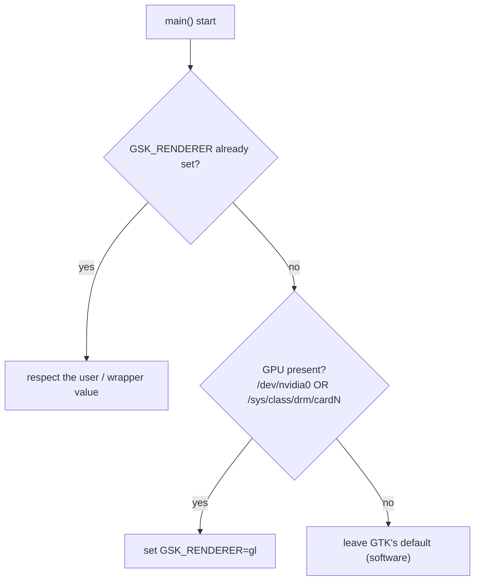

# Architecture Decision Records

Records of the architecture decisions behind the playback-CPU fix and the
multi-distro Debian packaging. Narrative and measurements live in
[`DEVLOG.md`](./DEVLOG.md); this file states the decisions, why they hold, and
what they cost.

Format: lightweight [MADR](https://adr.github.io/madr/). Status is per-record.

---

## ADR-0001 — Select the GSK renderer from GPU presence, in the binary

**Status:** Accepted, in validation (broad-GPU behaviour under test via the
`v1.1.2-cpu-deb-test2` release).

### Context

- GTK 4.14+ defaults to the **Vulkan** GSK renderer where Vulkan is available.
- The shell draws video into an OpenGL `GtkGLArea`. Compositing that GL texture
  through the Vulkan renderer forces a per-frame **GL → Vulkan bridge** that
  dominates playback CPU even with hardware decode — measured ~24% vs ~7.8% for
  the GL renderer on AMD/Mesa (see DEVLOG §1).
- The GL renderer composites a GL `GLArea` **natively**, with no bridge, so for
  this specific workload it cannot be slower than Vulkan on any driver.
- Upstream already worked around this, but only for the proprietary Nvidia
  driver (`/dev/nvidia0`) and only in the launcher script `data/stremio.sh`
  (commit `638b5af`). Upstream PR #69 (VA-API Wayland decode) is unrelated to the
  compositor renderer.

### Decision

Choose the renderer in the **binary**, before GTK initialises:

Implemented as `gpu::preferred_gsk_renderer()` (`src/gpu.rs`, std-only) returning
`Some("gl")` when a GPU is present, wired into `main.rs`.

Three sub-decisions:

1. **In the binary, not the shell wrapper.** `main.rs` runs in *every* package
   (deb, Flatpak, run-from-source); the wrapper is Flatpak/deb-only and Nvidia-only.
   The binary is the single place that fixes all of them, and it composes with
   the wrapper (which sets `opengl` for Nvidia first — respected by the `is_none`
   guard; `opengl` and `gl` are the same renderer).

2. **Gate on GPU presence, not GPU vendor.** The bridge cost is structural to
   "GL GLArea through the Vulkan compositor" and shared across Mesa drivers
   (AMD, Intel, nouveau); the GL renderer has no downside for this workload. A
   vendor allow-list would exclude drivers that pay the same cost on the excuse
   of "unmeasured". Only true software rendering (no GPU) keeps GTK's default.

3. **Value `gl`, and never override the user.** `gl` == `opengl` on GTK
   4.14–4.22 and is the canonical `GSK_RENDERER=help` name. An explicit
   `GSK_RENDERER` always wins.

### Consequences

**Positive**

- The CPU fix applies across GPU vendors and across all package formats.
- It also fixes run-from-source on Nvidia, which the wrapper-only approach misses.
- The renderer logic is isolated, documented, and testable in std-only code.

**Negative / risks**

- It **overrides GTK's chosen default (Vulkan)** for all GPU users — deliberate,
  but broader than upstream's Nvidia-only scope.
- The broad default is **verified only on AMD**; Intel and nouveau are reasoned
  from the shared Mesa mechanism, not measured. The residual risk is a
  driver-specific GL *visual* quirk, not CPU. Mitigated by (a) the `GSK_RENDERER`
  escape hatch and (b) the `v1.1.2-cpu-deb-test2` release for cross-GPU testing.
- If upstreamed, this changes the **official Flatpak** for all Linux users, so
  the blast radius warrants the cross-GPU testing before promotion.

### Alternatives considered

- **Unconditional `gl` (v1).** Simplest, but forces GL with no GPU and reads as a
  blunt override. GPU-present is barely more code and documents intent.
- **Nvidia-only, in the wrapper (upstream).** Under-inclusive: never fires on
  AMD (no `/dev/nvidia0`), so it would not have fixed the machine that motivated
  this work.
- **Vendor allow-list (Nvidia + AMD, v2).** Excludes Intel/nouveau, which share
  the mechanism; rejected as false conservatism.
- **Architectural fix — dmabuf paintable + `GtkGraphicsOffload`.** Feed mpv output
  as a dmabuf paintable and let GTK offload it to a Wayland subsurface, bypassing
  GSK compositing (and this whole renderer question) entirely. The correct
  long-term direction, but a rework of `src/app/video/imp.rs` and out of scope for
  a CPU fix. Recorded as future work.

---

## ADR-0002 — One `.deb` per Ubuntu release, built and verified in release containers

**Status:** Accepted.

### Context

- The crate pins GTK/libadwaita/WebKitGTK API levels via Cargo feature sets; a
  single build cannot target Ubuntu releases that ship different library
  versions.
- cargo-deb's `$auto` derives `Depends` names and floors from what the binary
  links — but only correctly when the matching `-dev` packages are present.
  Otherwise `dpkg-shlibdeps` invents a name from the SONAME (`libgtk-4` instead
  of the real `libgtk-4-1`) and the deb builds cleanly yet installs nowhere.
- A hand-pinned `Depends` (`libgtk-4-1 (>= 4.22) …`) is wrong for every release
  but one and made the 24.04 deb uninstallable.

### Decision

- **Targets are data:** `packaging/releases.json` maps each Ubuntu release to a
  feature set; CI and the local harness both read it, so they cannot drift.
- **Build each deb in a container of its target release**, so `$auto` resolves
  dependencies against that release's actual libraries. Encode the release in the
  Debian revision (`1~ubuntu24.04`) — `~` sorts before any suffix, so 24.04 →
  26.04 is an upgrade, not a phantom downgrade.
- **Verify by installing into a *fresh* container** of the same release (no
  `-dev` packages) before shipping — the only check that catches invented
  dependency names. This is `packaging/verify-deb.sh`, run identically by CI and
  `packaging/test-deb.sh`.
- `Depends = "$auto, nodejs"` (nodejs isn't linked, so `$auto` is blind to it);
  `Recommends = desktop-file-utils, hicolor-icon-theme` (dpkg file triggers for
  URL-scheme + icon registration; the app runs without them).

### Consequences

- Adding an Ubuntu release is one entry in `releases.json`.
- Correct, minimal `Depends` per release; regressions are caught before publish.
- **Ubuntu 22.04 cannot be targeted** at any feature set: `webkit6`'s generated
  bindings reference `gtk::Accessible` (GTK v4_10+), and 22.04 ships GTK 4.6. The
  failure is inside the dependency, so no feature selection avoids it.
- Slightly heavier CI (a container build + a fresh-container verify per release).

---

## Related decisions recorded elsewhere

These were decided during the same work but live in their natural homes:

- **GPU-video-processing / `d3d11vpp` toggle** is Windows-only; the Linux shell
  logs it as unsupported. No change.
- **VLC-in-Flatpak detection** cannot be fixed in this shell — player detection
  is in the closed-source `server.js`. Filed upstream. See DEVLOG §8.
- **`server.js` performance** is I/O-bound with no hotspot; no drop-in backend
  changes playback CPU. See DEVLOG §8.
