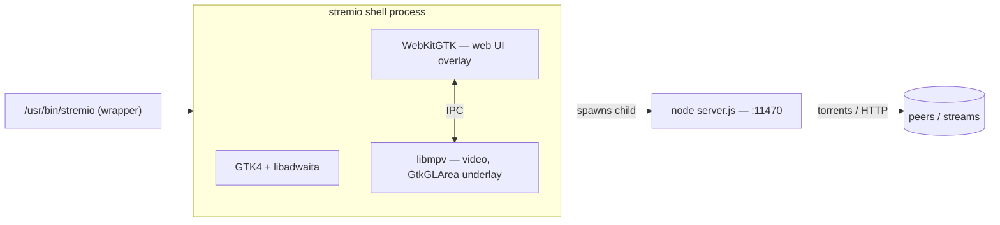
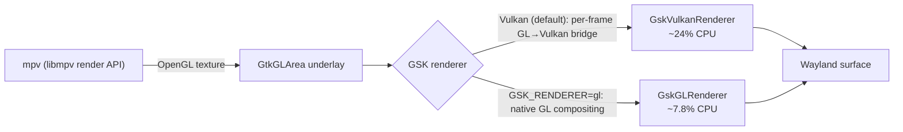
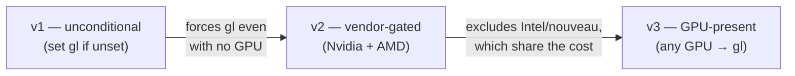

# Development Log — playback CPU fix & multi-distro Debian packaging

This log covers the investigation and changes made on the `test/cpu-fix-deb`
line of work: finding and fixing the dominant playback-CPU cost, packaging the
result as `.deb`s for multiple Ubuntu releases, and validating it on real
hardware and through the fork's release pipeline.

For the crystallised decisions (and their alternatives), see
[`ADR.md`](./ADR.md). This file is the narrative — including the paths we tried
and rejected, which the ADR does not dwell on.

---

## 0. The runtime we are tuning

Stremio's Linux shell is a GTK4/libadwaita app that draws the streaming web UI
in a WebKitGTK overlay and the video in an OpenGL `GtkGLArea` underlay fed by
libmpv's render API. A separate `node server.js` process (the closed-source
streaming server) runs the torrent/HTTP engine on `:11470`.



The playback CPU we care about is the **shell** process (compositing + decode);
`server.js` is a separate concern investigated in §8.

---

## 1. Finding the dominant playback-CPU cost

The starting complaint was high CPU during playback even though the video was
hardware-decoded. Decode and the WebKit UI were ruled out; the cost was in the
**GSK renderer**.

GTK 4.14+ defaults to the **Vulkan** GSK renderer. Our video is an OpenGL
`GtkGLArea`, and compositing a GL texture through the Vulkan renderer forces a
per-frame **GL → Vulkan bridge** that dominates CPU.



Re-measured on an **idle** machine (AMD Radeon 680M / Mesa, 1080p30 H.264,
`hwdec=vaapi` confirmed, GTK 4.22.4), 5 interleaved rounds per renderer, medians:

| GSK renderer                    | Playback CPU |
| ------------------------------- | ------------ |
| unset → `GskVulkanRenderer`     | ~24%         |
| `GSK_RENDERER=gl` → `GskGLRenderer` | **~7.8%** |
| bare `mpv --vo=gpu`, same clip  | ~7.1%        |

So on `gl` the whole GLArea/GSK path costs only ~0.7 points over mpv's own
output; the Vulkan default adds ~17. Decode was never the issue.

> **Measurement hygiene:** an earlier round (Vulkan ~52%, gl ~16%) was taken
> while Chrome burned ~81% CPU and is inflated ~2×. Every measurement here
> checks `/proc/loadavg` first — this box is a daily driver.

---

## 2. Why the renderer value is `gl`

`GSK_RENDERER` is parsed by GTK's `get_renderer_for_name()`. Reading the actual
source for our two target GTK versions (4.14.5 and 4.20.2):

- `gl` **and** `opengl` → `GskGLRenderer`, no warning, on both versions.
- `ngl` → same renderer but warns "renamed to gl" on 4.20+ (deprecated alias).
- An **unrecognised** name → warning, then falls back to the default renderer —
  which is **Vulkan**, the very thing we are avoiding.

Conclusion: `gl` and `opengl` are interchangeable on GTK 4.14–4.22; `gl` is the
name `GSK_RENDERER=help` lists, so that is what we set. Only an unrecognised
value would silently cost us the fix.

---

## 3. How the fix evolved

The fix changed shape three times as we reasoned about who it should apply to.



**v1 — unconditional.** `main.rs` set `GSK_RENDERER=gl` whenever it was unset.
Simple and effective, but forces GL even where there is no GPU, and reads as a
blunt global override.

**Comparing with upstream.** Two upstream touchpoints were checked:

- **PR #69** ("Fix video acceleration with VA-API for Intel") is **orthogonal**:
  it passes `RenderParam::WaylandDisplay` into mpv's render context so the
  VA-API *decoder* can reach the Wayland display. It does not touch the GSK
  compositor renderer.
- **Commit `638b5af`** is the real overlap: `data/stremio.sh` exports
  `GSK_RENDERER=opengl` **only when `/dev/nvidia0` exists**, and only in the
  launcher script (Flatpak, and our deb's `/usr/bin/stremio`).

So upstream reached the same conclusion but scoped it to **Nvidia only**, in the
wrapper.

**v2 — vendor-gated (Nvidia + AMD).** To mirror upstream's targeting while
covering our measured AMD case, detection was moved into the binary and gated to
`/dev/nvidia0` **or** the AMD PCI vendor id (`0x1002`). Intel and nouveau were
left on GTK's default "because unmeasured."

**v3 — GPU-present (the current design).** That exclusion was the wrong kind of
conservatism. Intel and nouveau are Mesa drivers, structurally identical to AMD
in how GTK bridges a GL `GLArea` into the Vulkan renderer — so they almost
certainly pay the same cost. And the GL renderer composites the GLArea
*natively*, with no bridge, so it cannot be **slower** on any GPU for this
workload. The only real risk is a driver-specific GL visual quirk, not CPU.

The final rule: **prefer `gl` whenever a GPU is present**, leaving only GPU-less
software rendering on GTK's default, and always yielding to an explicit
`GSK_RENDERER`. This covers AMD, Intel, nouveau and Nvidia alike, in every
package.

---

## 4. GPU detection module and its test

`src/gpu.rs` (std-only) owns the decision:

```rust
pub fn preferred_gsk_renderer() -> Option<&'static str> {
    has_gpu().then_some("gl")   // /dev/nvidia0 || any /sys/class/drm/cardN
}
```

`main.rs` applies it before GTK initialises, only if `GSK_RENDERER` is unset:

```rust
if env::var_os("GSK_RENDERER").is_none()
    && let Some(renderer) = gpu::preferred_gsk_renderer()
{
    unsafe { env::set_var("GSK_RENDERER", renderer) };
}
```

**Testing was TDD, without unit tests.** `packaging/test-gsk-renderer.sh` is a
*differential* test: it recomputes the decision independently in shell from the
same OS facts (`/dev/nvidia0`, `/sys/class/drm/cardN`) and asserts the real
detection code agrees. The code is exercised through `examples/gpu_probe.rs`,
which `#[path]`-includes `src/gpu.rs` and is compiled standalone with
`rustc --edition 2024` — no cargo, no GTK/mpv tree, no display, no fixtures. It
runs on real hardware and confirms the fix actually fires (e.g. prints `gl` on
AMD). The test was written first (red: `src/gpu.rs` absent), then made green.

---

## 5. Multi-distro `.deb` packaging

Packaging targets are data, not code. `packaging/releases.json` maps each Ubuntu
release to a Cargo feature set; both CI (`.github/workflows/release.yml`) and the
local harness (`packaging/test-deb.sh`) read that one file.

| Release | Feature set | GTK / libadwaita / WebKitGTK |
| ------- | ----------- | ---------------------------- |
| 24.04 noble    | `api-4_14` | 4.14.5 / 1.5.0 / 2.52.3 |
| 26.04 resolute | `api-4_22` | 4.22.4 / 1.9.0 / 2.52.3 |

Key packaging choices (detailed in ADR-0002):

- **One deb per release, built in a container of that release**, so cargo-deb's
  `$auto` resolves `Depends` via `dpkg-shlibdeps` against the libraries that
  release actually ships. A hand-pinned `Depends` produced a deb that could not
  install on 24.04 at all.
- **Verified by installing into a *fresh* container** of the same release — the
  only way to catch a deb that names packages which do not exist (dpkg-shlibdeps
  invents `libgtk-4` from the SONAME when `-dev` packages are absent).
- `nodejs` is added to `Depends` by hand (`$auto` can't see it — it's not
  linked); `desktop-file-utils` + `hicolor-icon-theme` are `Recommends`, driven
  by dpkg file triggers for URL-scheme and icon registration.
- **Ubuntu 22.04 is impossible**, not skipped: `webkit6`'s generated bindings
  reference `gtk::Accessible` (needs GTK v4_10+), and 22.04 ships GTK 4.6.

---

## 6. Validation on real hardware

Built the resolute deb natively (`cargo deb --deb-revision 1~ubuntu26.04 --
--no-default-features --features api-4_22`), installed it over the running
instance, and confirmed the fix end-to-end:

```
Environment variable GSK_RENDERER=gl set, trying GskGLRenderer
Using renderer 'GskGLRenderer' for surface 'GdkWaylandToplevel'
```

CPU during real playback (even with the box contaminated — loadavg ~4–5, 85
Chrome processes): **shell 6.8%**, `node server.js` **0.0%** — squarely in the
GL band, nowhere near the ~24% Vulkan default.

> **Gotcha — verifying env vars:** `/proc/<pid>/environ` shows the environment
> at `exec` time only. `env::set_var` (glibc `setenv`) adds the variable on the
> heap *after* exec, so it never appears there. The renderer must be verified via
> `GSK_DEBUG=renderer`, not `/proc/environ`.

> **Gotcha — orphaned streaming server:** force-killing the shell orphans its
> `node server.js` child, which keeps holding `:11470`. A later shell then can't
> bind a clean server and playback sits at "0 peers". A normal quit cleans the
> child up; external `kill`s during testing do not. Cure: kill the shell **and**
> all `stremio` node servers, then relaunch one clean pair.

---

## 7. Fork release for cross-GPU testing

To test on non-AMD hardware, the commit was pushed to the fork and released as
`v1.1.2-cpu-deb-test2`, which triggers `.github/workflows/release.yml`: build one
deb per release in a container, verify each in a fresh container, attach to the
release (plus a Flatpak). All jobs green; both debs verified installable on
stock 24.04 and 26.04.

The open question this release exists to answer: is the broad GL default safe on
**Intel / nouveau / Nvidia**, or does forcing GL expose a driver-specific visual
quirk? Per-machine check: `GSK_DEBUG=renderer stremio` should log
`GskGLRenderer`, then confirm the picture, fullscreen/scaling, and CPU.

---

## 8. Related investigations (concluded, no code change here)

- **`server.js` is not a CPU bottleneck.** Profiled during live 4K streaming:
  ~94% idle, <1% in Stremio's own code — it is I/O-bound (blocked in `epoll`),
  not transcoding (no ffmpeg). The earlier high number was CPU contention. A
  Bun/Rust ("stream-server") swap would win on memory/startup/no-node-dep, not
  on playback CPU; it is closed-source so not patchable here. WASM is a non-start
  for a BitTorrent engine (no raw TCP/UDP in the browser sandbox).
- **VLC-in-Flatpak isn't offered as an external player.** Detection lives in the
  closed-source `server.js`, which probes fixed paths (`/usr/bin/vlc`, …) with
  `fs.existsSync` — it can't see a Flatpak VLC, and the "Play in VLC" action is a
  literal `child.exec`, not an XDG portal call. Filed as an upstream issue; not
  fixable in this shell.
- **KDE menu "missing" entry** was a desktop-ID collision with a Flatpak install
  (XDG_DATA_DIRS precedence), not a packaging bug.

---

## 9. Current state & next step

- `src/gpu.rs`, `main.rs` wiring, `examples/gpu_probe.rs`, and
  `packaging/test-gsk-renderer.sh` are committed on `test/cpu-fix-deb`.
- The open PR (`fix/playback-cpu`) is deliberately **untouched**; the code commit
  is a clean cherry-pick once cross-GPU testing confirms the broad default.
- Awaiting Intel / nouveau / Nvidia results from the `test2` release.
