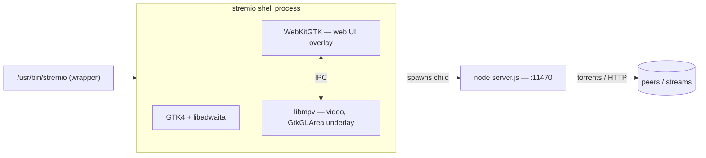
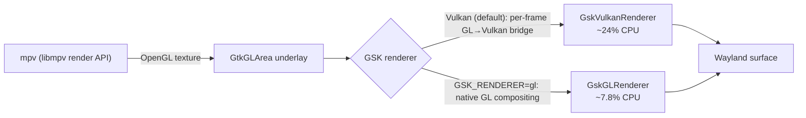
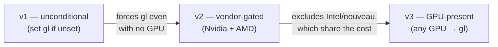
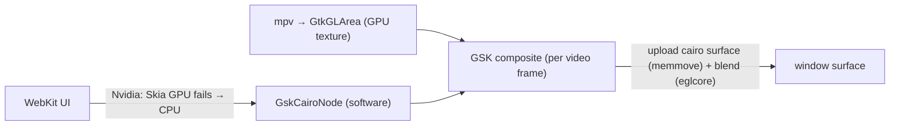

# Development Log — playback CPU fix & multi-distro Debian packaging

This log covers the investigation and changes made on the `test/cpu-fix-deb`
line of work: finding and fixing the dominant playback-CPU cost, packaging the
result as `.deb`s for multiple Ubuntu releases, and validating it on real
hardware and through the fork's release pipeline.

For the crystallised decisions (and their alternatives), see
[`ADR.md`](./ADR.md). This file is the narrative — including the paths we tried
and rejected, which the ADR does not dwell on.

---

## 0. The runtime we are tuning

Stremio's Linux shell is a GTK4/libadwaita app that draws the streaming web UI
in a WebKitGTK overlay and the video in an OpenGL `GtkGLArea` underlay fed by
libmpv's render API. A separate `node server.js` process (the closed-source
streaming server) runs the torrent/HTTP engine on `:11470`.



The playback CPU we care about is the **shell** process (compositing + decode);
`server.js` is a separate concern investigated in §8.

---

## 1. Finding the dominant playback-CPU cost

The starting complaint was high CPU during playback even though the video was
hardware-decoded. Decode and the WebKit UI were ruled out; the cost was in the
**GSK renderer**.

GTK 4.14+ defaults to the **Vulkan** GSK renderer. Our video is an OpenGL
`GtkGLArea`, and compositing a GL texture through the Vulkan renderer forces a
per-frame **GL → Vulkan bridge** that dominates CPU.



Re-measured on an **idle** machine (AMD Radeon 680M / Mesa, 1080p30 H.264,
`hwdec=vaapi` confirmed, GTK 4.22.4), 5 interleaved rounds per renderer, medians:

| GSK renderer                    | Playback CPU |
| ------------------------------- | ------------ |
| unset → `GskVulkanRenderer`     | ~24%         |
| `GSK_RENDERER=gl` → `GskGLRenderer` | **~7.8%** |
| bare `mpv --vo=gpu`, same clip  | ~7.1%        |

So on `gl` the whole GLArea/GSK path costs only ~0.7 points over mpv's own
output; the Vulkan default adds ~17. Decode was never the issue.

> **Measurement hygiene:** an earlier round (Vulkan ~52%, gl ~16%) was taken
> while Chrome burned ~81% CPU and is inflated ~2×. Every measurement here
> checks `/proc/loadavg` first — this box is a daily driver.

---

## 2. Why the renderer value is `gl`

`GSK_RENDERER` is parsed by GTK's `get_renderer_for_name()`. Reading the actual
source for our two target GTK versions (4.14.5 and 4.20.2):

- `gl` **and** `opengl` → `GskGLRenderer`, no warning, on both versions.
- `ngl` → same renderer but warns "renamed to gl" on 4.20+ (deprecated alias).
- An **unrecognised** name → warning, then falls back to the default renderer —
  which is **Vulkan**, the very thing we are avoiding.

Conclusion: `gl` and `opengl` are interchangeable on GTK 4.14–4.22; `gl` is the
name `GSK_RENDERER=help` lists, so that is what we set. Only an unrecognised
value would silently cost us the fix.

---

## 3. How the fix evolved

The fix changed shape three times as we reasoned about who it should apply to.



**v1 — unconditional.** `main.rs` set `GSK_RENDERER=gl` whenever it was unset.
Simple and effective, but forces GL even where there is no GPU, and reads as a
blunt global override.

**Comparing with upstream.** Two upstream touchpoints were checked:

- **PR #69** ("Fix video acceleration with VA-API for Intel") is **orthogonal**:
  it passes `RenderParam::WaylandDisplay` into mpv's render context so the
  VA-API *decoder* can reach the Wayland display. It does not touch the GSK
  compositor renderer.
- **Commit `638b5af`** is the real overlap: `data/stremio.sh` exports
  `GSK_RENDERER=opengl` **only when `/dev/nvidia0` exists**, and only in the
  launcher script (Flatpak, and our deb's `/usr/bin/stremio`).

So upstream reached the same conclusion but scoped it to **Nvidia only**, in the
wrapper.

**v2 — vendor-gated (Nvidia + AMD).** To mirror upstream's targeting while
covering our measured AMD case, detection was moved into the binary and gated to
`/dev/nvidia0` **or** the AMD PCI vendor id (`0x1002`). Intel and nouveau were
left on GTK's default "because unmeasured."

**v3 — GPU-present (the current design).** That exclusion was the wrong kind of
conservatism. Intel and nouveau are Mesa drivers, structurally identical to AMD
in how GTK bridges a GL `GLArea` into the Vulkan renderer — so they almost
certainly pay the same cost. And the GL renderer composites the GLArea
*natively*, with no bridge, so it cannot be **slower** on any GPU for this
workload. The only real risk is a driver-specific GL visual quirk, not CPU.

The final rule: **prefer `gl` whenever a GPU is present**, leaving only GPU-less
software rendering on GTK's default, and always yielding to an explicit
`GSK_RENDERER`. This covers AMD, Intel, nouveau and Nvidia alike, in every
package.

---

## 4. GPU detection module and its test

`src/gpu.rs` (std-only) owns the decision:

```rust
pub fn preferred_gsk_renderer() -> Option<&'static str> {
    has_gpu().then_some("gl")   // /dev/nvidia0 || any /sys/class/drm/cardN
}
```

`main.rs` applies it before GTK initialises, only if `GSK_RENDERER` is unset:

```rust
if env::var_os("GSK_RENDERER").is_none()
    && let Some(renderer) = gpu::preferred_gsk_renderer()
{
    unsafe { env::set_var("GSK_RENDERER", renderer) };
}
```

**Testing was TDD, without unit tests.** `packaging/test-gsk-renderer.sh` is a
*differential* test: it recomputes the decision independently in shell from the
same OS facts (`/dev/nvidia0`, `/sys/class/drm/cardN`) and asserts the real
detection code agrees. The code is exercised through `examples/gpu_probe.rs`,
which `#[path]`-includes `src/gpu.rs` and is compiled standalone with
`rustc --edition 2024` — no cargo, no GTK/mpv tree, no display, no fixtures. It
runs on real hardware and confirms the fix actually fires (e.g. prints `gl` on
AMD). The test was written first (red: `src/gpu.rs` absent), then made green.

---

## 5. Multi-distro `.deb` packaging

Packaging targets are data, not code. `packaging/releases.json` maps each Ubuntu
release to a Cargo feature set; both CI (`.github/workflows/release.yml`) and the
local harness (`packaging/test-deb.sh`) read that one file.

| Release | Feature set | GTK / libadwaita / WebKitGTK |
| ------- | ----------- | ---------------------------- |
| 24.04 noble    | `api-4_14` | 4.14.5 / 1.5.0 / 2.52.3 |
| 26.04 resolute | `api-4_22` | 4.22.4 / 1.9.0 / 2.52.3 |

Key packaging choices (detailed in ADR-0002):

- **One deb per release, built in a container of that release**, so cargo-deb's
  `$auto` resolves `Depends` via `dpkg-shlibdeps` against the libraries that
  release actually ships. A hand-pinned `Depends` produced a deb that could not
  install on 24.04 at all.
- **Verified by installing into a *fresh* container** of the same release — the
  only way to catch a deb that names packages which do not exist (dpkg-shlibdeps
  invents `libgtk-4` from the SONAME when `-dev` packages are absent).
- `nodejs` is added to `Depends` by hand (`$auto` can't see it — it's not
  linked); `desktop-file-utils` + `hicolor-icon-theme` are `Recommends`, driven
  by dpkg file triggers for URL-scheme and icon registration.
- **Ubuntu 22.04 is impossible**, not skipped: `webkit6`'s generated bindings
  reference `gtk::Accessible` (needs GTK v4_10+), and 22.04 ships GTK 4.6.

---

## 6. Validation on real hardware

Built the resolute deb natively (`cargo deb --deb-revision 1~ubuntu26.04 --
--no-default-features --features api-4_22`), installed it over the running
instance, and confirmed the fix end-to-end:

```
Environment variable GSK_RENDERER=gl set, trying GskGLRenderer
Using renderer 'GskGLRenderer' for surface 'GdkWaylandToplevel'
```

CPU during real playback (even with the box contaminated — loadavg ~4–5, 85
Chrome processes): **shell 6.8%**, `node server.js` **0.0%** — squarely in the
GL band, nowhere near the ~24% Vulkan default.

> **Gotcha — verifying env vars:** `/proc/<pid>/environ` shows the environment
> at `exec` time only. `env::set_var` (glibc `setenv`) adds the variable on the
> heap *after* exec, so it never appears there. The renderer must be verified via
> `GSK_DEBUG=renderer`, not `/proc/environ`.

> **Gotcha — orphaned streaming server:** force-killing the shell orphans its
> `node server.js` child, which keeps holding `:11470`. A later shell then can't
> bind a clean server and playback sits at "0 peers". A normal quit cleans the
> child up; external `kill`s during testing do not. Cure: kill the shell **and**
> all `stremio` node servers, then relaunch one clean pair.

---

## 7. Fork release for cross-GPU testing

To test on non-AMD hardware, the commit was pushed to the fork and released as
`v1.1.2-cpu-deb-test2`, which triggers `.github/workflows/release.yml`: build one
deb per release in a container, verify each in a fresh container, attach to the
release (plus a Flatpak). All jobs green; both debs verified installable on
stock 24.04 and 26.04.

The open question this release exists to answer: is the broad GL default safe on
**Intel / nouveau / Nvidia**, or does forcing GL expose a driver-specific visual
quirk? Per-machine check: `GSK_DEBUG=renderer stremio` should log
`GskGLRenderer`, then confirm the picture, fullscreen/scaling, and CPU.

---

## 8. Related investigations (concluded, no code change here)

- **`server.js` is not a CPU bottleneck.** Profiled during live 4K streaming:
  ~94% idle, <1% in Stremio's own code — it is I/O-bound (blocked in `epoll`),
  not transcoding (no ffmpeg). The earlier high number was CPU contention. A
  Bun/Rust ("stream-server") swap would win on memory/startup/no-node-dep, not
  on playback CPU; it is closed-source so not patchable here. WASM is a non-start
  for a BitTorrent engine (no raw TCP/UDP in the browser sandbox).
- **VLC-in-Flatpak isn't offered as an external player.** Detection lives in the
  closed-source `server.js`, which probes fixed paths (`/usr/bin/vlc`, …) with
  `fs.existsSync` — it can't see a Flatpak VLC, and the "Play in VLC" action is a
  literal `child.exec`, not an XDG portal call. Filed as an upstream issue; not
  fixable in this shell.
- **KDE menu "missing" entry** was a desktop-ID collision with a Flatpak install
  (XDG_DATA_DIRS precedence), not a packaging bug.

---

## 9. Current state & next step

- `src/gpu.rs`, `main.rs` wiring, `examples/gpu_probe.rs`, and
  `packaging/test-gsk-renderer.sh` are committed on `test/cpu-fix-deb`.
- The open PR (`fix/playback-cpu`) is deliberately **untouched**; the code commit
  is a clean cherry-pick once cross-GPU testing confirms the broad default.
- Awaiting Intel / nouveau / Nvidia results from the `test2` release.

---

## 10. The Nvidia gap: `gl` is necessary but not sufficient

The `test2` release (§7) was meant to answer "is forcing `gl` safe on Nvidia?".
Testing it on the Nvidia box (GTX 1060, driver 580, KDE Plasma 6 / Wayland)
answered a bigger question instead: **on Nvidia the `gl` renderer is not enough
— a full CPU core is still pinned during playback, and the picture shows
compositing artifacts.**

Measured with the resolute deb (which already forces `gl` via both `gpu.rs` and
the wrapper), 1080p/4K playback, hardware-decoded:

| Machine                      | Renderer | Playback CPU (shell) | Artifacts |
| ---------------------------- | -------- | -------------------- | --------- |
| AMD 680M (Mesa) — §1          | `gl`     | ~7.8% (≈ mpv alone)  | none      |
| **Nvidia GTX 1060 (prop.)**   | `gl`     | **~100% of one core**| **yes**   |

Every GSK renderer and window backend was ruled out on Nvidia — all identical:

| Renderer / backend      | Main-thread CPU | Notes |
| ----------------------- | --------------- | ----- |
| `opengl` / Wayland       | ~90–100%        | wrapper default |
| `ngl` / Wayland          | ~85–98%         | new GL renderer |
| `vulkan` / Wayland       | ~95–103%        | GTK 4.22 default |
| `opengl` / XWayland      | ~96–100%        | forced X11 backend |

The cost is one **single-threaded** core (system-wide ~18% busy on a 12-thread
box, load ~1.2). Per-process GPU counters during playback: **NVDEC `dec` ~12%**
(decode is on the GPU ✓) and **shaders `sm` ~12%** — the GPU is *lightly* loaded
while the CPU core is pinned. So this is neither software video decode (the
`av:hevc` threads are idle, `cuda-EvtHandlr` is present) nor a Vulkan bridge (the
`gl` renderer has no bridge). Something on the main thread is spending a core
while the GPU idles.

> The old spin-loops (§ pre-`8aeb9bb`) were already ruled out: with the
> `timeout`/`spawn_local` loops, the menu sits at ~1–3% CPU. The pegged core only
> appears once the player view (the `GtkGLArea`) is realised **and** playing.

## 11. Root cause on Nvidia: WebKit renders the UI in software

`perf` (DWARF) on the pinned main thread — self cost, not children:

| Cost | Symbol | Meaning |
| ---- | ------ | ------- |
| ~6%  | `__memmove_avx_unaligned_erms` (libc) | a per-frame CPU **memory copy** |
| ~1–2% | `libpixman` | cairo's **software** rasteriser |
| ~8–10% | `libnvidia-eglcore` (fragmented) | GL upload / composite |
| ~8%  | kernel | syscalls around the above |

Not a driver spin — **data movement + software compositing**. `GDK_DEBUG=offload`
named it exactly. Every video frame:

```
[webview subsurface] 🗙 Only textures supported (found GskCairoNode)
```

The window is a `GtkOverlay`: the video `GtkGLArea` is the base child, the
WebKitGTK web UI is a full-window **transparent** overlay on top (the code even
wraps that overlay in `GtkGraphicsOffload`). On Nvidia, **WebKitGTK's GTK4 port
fails to bring up its Skia *GPU* context and falls back to the Skia *CPU*
worker**, so the web UI snapshots to a `GskCairoNode` — a software surface. Then:



Because the software UI **overlaps** the video and the video changes every frame,
GSK re-uploads and re-composites that cairo surface on the CPU 60×/second. On
Mesa (AMD/Intel/nouveau) Skia GPU works → the UI is a **texture** node → GSK
composites it on the GPU → cheap. **That single difference — WebKit GPU vs CPU
rendering — is the entire Nvidia-vs-AMD split, and the `gl` renderer cannot touch
it because the cost lives inside WebKit, upstream of GSK.**

Context — and one thing to *not* mis-cite:

- [WebKitGTK 2.46 switched Cairo → Skia](https://blogs.igalia.com/carlosgc/2024/09/27/graphics-improvements-in-webkitgtk-and-wpewebkit-2-46/), with **GPU rendering the default and a CPU (threaded-Skia) fallback**. Whether the GPU path comes up "depends on … the driver version, the kernel version, the system compositor, the EGL extensions available." On the proprietary Nvidia driver it comes up as the **CPU** worker here — hence the `GskCairoNode`.
- [bugs.webkit.org #228268](https://bugs.webkit.org/show_bug.cgi?id=228268) is **RESOLVED/FIXED** — but it covers the *old* GTK4-Nvidia **blank-screen** regression (a depth-32 X11 visual with no alpha), **not** today's Skia-GPU-won't-init-on-Nvidia behaviour. Do not file this CPU issue as a dup of #228268.
- There is **no documented env var to force the Skia GPU path up on Nvidia**; `WEBKIT_DISABLE_DMABUF_RENDERER=1` only pushes further toward software.

> **Prove it on any box:** open **`webkit://gpu`** (or `webkit://gpu/stdout`) in
> the WebView — it reports the active rendering backend, i.e. whether Skia is on
> GPU or CPU. This is the definitive check for "is WebKit software-rendering here".

**Upstream awareness (as of 2026-07):** the project already fixed the *GSK*
half — commit `638b5af` forces `GSK_RENDERER=opengl` on `/dev/nvidia0`, and open
**PR #108** generalises `gl` to all GPUs (measured ~24% → ~7.8% on AMD, refs
issue **#103**). But **no upstream issue or PR addresses the WebKit
software-render recomposite, the ineffective `GtkGraphicsOffload`-around-a-WebView,
or fractional-scaling defeating offload** — that is the ground this work owns.
Issue **#77** (SIGSEGV inside `libnvidia-glcore`/`libnvidia-eglcore`, one frame in
the `WebKitWebProcess` child) is separate corroboration that the GL/EGL handoff in
this overlay/underlay design is fragile on the proprietary driver.

**What did not work** (each verified live — the webview stayed a `GskCairoNode`
and playback CPU stayed ~80–100%; note these were on a *debug* build, so absolute
numbers are inflated but the node-type verdict is build-independent):

| Attempt | Result |
| ------- | ------ |
| `settings.set_hardware_acceleration_policy(Always)` | still `GskCairoNode` |
| move `GtkGraphicsOffload` from webview → video `GtkGLArea` | `Lowering because a GskCairoNode overlaps` — offload defeated by the software overlap, CPU unchanged |
| `WEBKIT_DISABLE_DMABUF_RENDERER=1` | still `GskCairoNode` |
| `WEBKIT_FORCE_SANDBOX=0` | still `GskCairoNode` |

A second, independent blocker turned up in the same trace: with the display at
**170 % fractional scale**, offload also reports `Non-integral device
coordinates`. This is by design — [GTK **declines to offload at fractional
scales**](https://blog.gtk.org/2024/04/17/graphics-offload-revisited/) ("integral
device pixel positions are needed"). So on this exact machine, even a *texture*
video node **cannot** be offloaded to a subsurface until the scale is integer
(100 %/200 %) — a hard constraint the fix below has to account for.

> **Verified fix candidate needs a dmabuf video path.** `GtkGraphicsOffload` only
> offloads a widget whose content is a single **dmabuf** texture. A `GtkGLArea`
> renders into a GL FBO (a `GskGLTextureNode`, not a scanout dmabuf), which is why
> offloading it "lowers" but never truly hands the frame to the compositor. See
> [ADR-0003](./ADR.md) for the proposed rework.

## 12. A second, separate bug: `hwdec=auto-safe` artifacts on Nvidia

The artifacts are **not** the same bug as the CPU. They reproduce on the **deb**
but **not** on the upstream **stable Flatpak** — even though both run the same
GTK 4.22.4 / libmpv 2.5.0 and both hit the WebKit-cairo path above. The
difference is code, and it narrows to one branch-only change.

`a7597b7 "fix(video): enable hardware decoding by default"` sets
`hwdec=auto-safe` in the mpv initialiser **and** remaps the web UI's deliberate
`hwdec=auto-copy` request to `auto-safe` (`video/mod.rs:131`). `auto-safe` uses
the **zero-copy** GPU interop; `auto-copy` copies frames back through system
memory. That commit was verified on **VAAPI/Mesa only** ("Using EGL dmabuf
interop via `GL_OES_EGL_image` … Initialized VAAPI") — never on Nvidia's
nvdec/CUDA-GL interop, which is exactly where the zero-copy path is fragile.

Upstream `main` sets no `hwdec` (so the web UI's `auto-copy` stands), which is why
the stable Flatpak decodes copy-back and shows no artifacts. **Forcing zero-copy
on Nvidia is the regression** — and it is not local to this branch: the same two
commits (`a7597b7` + the `c1123bc` remap) ride in **upstream PR #108**, so if that
PR merges as-is it ships the Nvidia artifacts to the official Flatpak. Not yet
re-tested with `auto-copy` on the Nvidia box (needs a playback session); the fix
direction is in [ADR-0003](./ADR.md).

## 13. The Flatpak launcher regression (fixed)

While reproducing on the deb, the devel Flatpak would not start:

```
/app/bin/stremio: line 12: /usr/libexec/stremio/stremio: No such file or directory
```

`e6fb216 "build: add deb package"` had moved the launcher's env exports into
`data/stremio.sh` and hardcoded them to `/usr/libexec` — correct for the deb, but
the Flatpak installs the binary and `server.js` under `/app`. The same commit also
dropped the manifest's `--env=SERVER_PATH=/app/...` that had masked it. Both
packages install the wrapper at `<prefix>/bin/stremio`, so the wrapper now
derives its prefix from its own path (`$0` → `.../bin/stremio` → prefix) and one
file serves both. Committed on `build/deb-multi-distro` (where the regression was
introduced) as `fix(flatpak): derive install prefix in the launcher so it works
in /app`.

## 14. Cross-platform regression audit

Comparing the branch against upstream `main`, change by change:

| Change | On `main`? | Regression risk |
| ------ | ---------- | --------------- |
| `gpu.rs` → force `GSK_RENDERER=gl` when a GPU is present | no | Low. Measured better on AMD; same renderer upstream already forces for Nvidia. **Unverified visual behaviour on Intel/nouveau** (ADR-0001 risk). |
| `8aeb9bb` timeout/`spawn_local` event+render loops | no | **Improvement, not a regression** — `main` still busy-polls with `idle_add_local` (a pegged core at idle). |
| `a7597b7` + remap → force `hwdec=auto-safe` | no | **Regression on Nvidia** (§12 artifacts). Verified on Mesa only. |
| `ca9afe8` `WaylandDisplay` render param (VA-API) | yes | Upstream; not implicated. |
| `638b5af` `opengl` for `/dev/nvidia0` in wrapper | yes | Upstream; `gl == opengl`. |
| `data/stremio.sh` prefix-relative (§13) | new | None — deb resolves to `/usr` exactly as before; only adds the `/app` case. |

Net: one real regression (`hwdec=auto-safe` on Nvidia), one silent improvement
(the loop fix), and one unverified-but-reasoned default (`gl` on Intel/nouveau).

## 15. Where this leaves us

- **AMD/Mesa:** genuinely fixed by `gl` (24% → ~8%). Keep it.
- **Nvidia CPU:** an upstream WebKitGTK limitation (software UI rendering), not
  fixable in `gpu.rs`. The shell's only real lever is to stop compositing the UI
  over the video every frame — i.e. put the **video** on its own compositor
  subsurface via a dmabuf paintable, so video frames bypass GSK entirely and the
  software UI is only re-composited when *it* changes. See [ADR-0003](./ADR.md).
- **Nvidia artifacts:** a self-inflicted `hwdec` regression; revert/limit
  `auto-safe` on the Nvidia interop.
- Next hardware session (playback required): confirm `auto-copy` clears the
  artifacts, and prototype the dmabuf-offload video path from ADR-0003.
